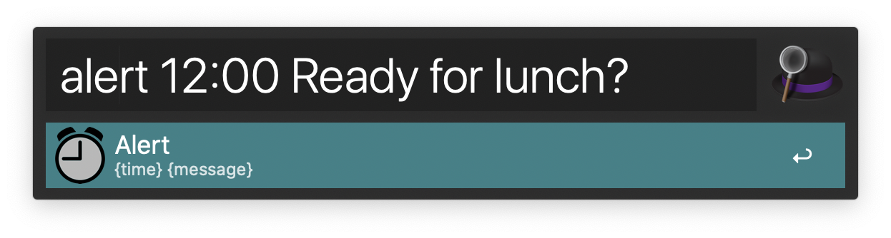
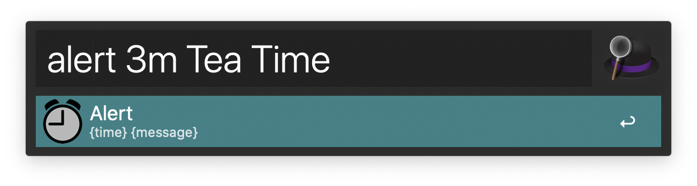

# Alert Workflow for [Alfred][alfred]

Show an alert on the screen and a notification with Alfred:
- at a specific time
- after a time span

**[Download the workflow][download]**

## Absolute times:
* `07:51:38`
* `14:00`
* `7:40PM`

## Relative times:
* `5` corresponds to seconds
* `180s` corresponds to 3 minutes
* `7m` corresponds to 7 minutes
* `12h` corresponds to 12 hours

## Examples
* `180 Egg is finished
* `12:00 Don't forget to eat lunch

## Screen shots

## History

* Version 1.0.1
	- Fixed parsing of absolute time with seconds
	- Allow to run multiple workflows

* Version 1.0.0
  - Initial Release

[download]: https://github.com/Macintron/Alfred-Workflow-Alert/releases/download/v1.0.1/Alert.v1.0.1.alfredworkflow
[alfred]: http://www.alfredapp.com